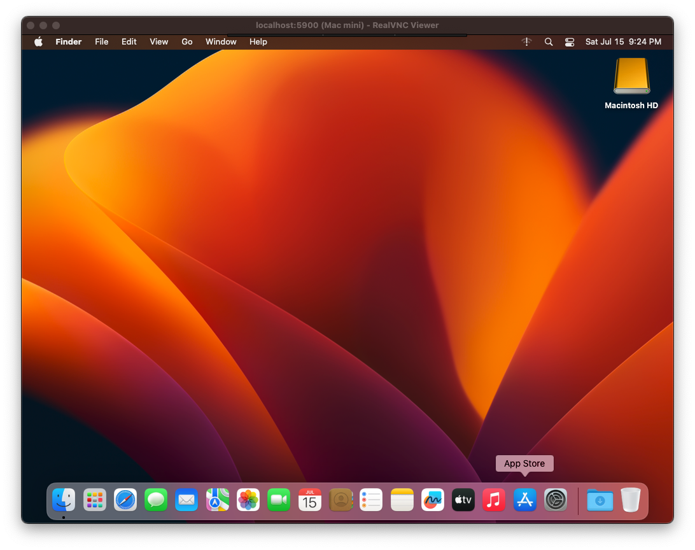

# aws-macos

This template creates a dedicated host and macOS instance on AWS EC2. This costs a minimum of $26/workspace/day and has several other limitations. Keep reading for more details.

## Limitations

- A workspace cannot be deleted 24 hours after creation due to [AWS dedicated host limitations](https://docs.aws.amazon.com/AWSEC2/latest/UserGuide/ec2-mac-instances.html).

- You must have the `aws` CLI installed (and authenticated) on the system running coderd (or [provisoners](https://coder.com/docs/v2/latest/admin/provisioners)). This is used for starting/stopping the instance.

- After being stopped, the dedicated host enters a `Pending` state which prevents the workspace from being started for at least 10 minutes. This is due to a [scrubbing workflow](https://docs.aws.amazon.com/AWSEC2/latest/UserGuide/ec2-mac-instances.html#mac-instance-stop) that AWS performs on macOS instances. The workspace can be started after the dedicated host enters an `Available` state.

- Safari does not seem to work on macOS instances. This is likely due to the lack of a GPU.

## Troubleshooting Logs

To view logs, you need to modify `main.tf` to add your SSH key, change security groups, and enter the instance manually.

```text
resource "aws_instance" "workspace" {
  # ... everything else
  security_groups = ["YOUR_GROUP"]
  key_name = "YOUR_SSH_KEY"
```

Logs are stored in:

```sh
/var/log/amazon/ec2
```

This template uses [ec2_macos_init](https://github.com/aws/ec2-macos-init) to start the agent. You can see the init config here:

```text
/usr/local/aws/ec2-macos-init/init.toml
```

## VNC / remote desktop access

First, enable VNC access and set a password for the `coder` user on your VM:

```sh
sudo defaults write /var/db/launchd.db/com.apple.launchd/overrides.plist com.apple.screensharing -dict Disabled -bool false
sudo launchctl load -w /System/Library/LaunchDaemons/com.apple.screensharing.plist
sudo /usr/bin/dscl . -passwd /Users/ec2-user
# Create a password for the ec2-user
```

At this time, you must use the `coder` CLI on your local machine to port forward to this workspace.

```sh
curl -L https://coder.com/install.sh | sh
coder login <your-deployment-url>
coder port-forward <your-workspace> --tcp 5900
```

From there, you can connect using any desktop VNC client to `localhost:5900`. Additional third-party remote desktop servers can be installed on the VM as well.



## Authentication

This template assumes that coderd is run in an environment that is authenticated
with AWS. For example, run `aws configure import` to import credentials on the
system and user running coderd. For other ways to authenticate [consult the
Terraform docs](https://registry.terraform.io/providers/hashicorp/aws/latest/docs#authentication-and-configuration).

## Required permissions / policy

This template requires a slightly different policy than the [aws-linux](https://github.com/coder/coder/tree/main/examples/templates/aws-linux) template since it also creates a dedicated host. I have not determined the minimum set of permissions yet and have only tested with an admin policy.