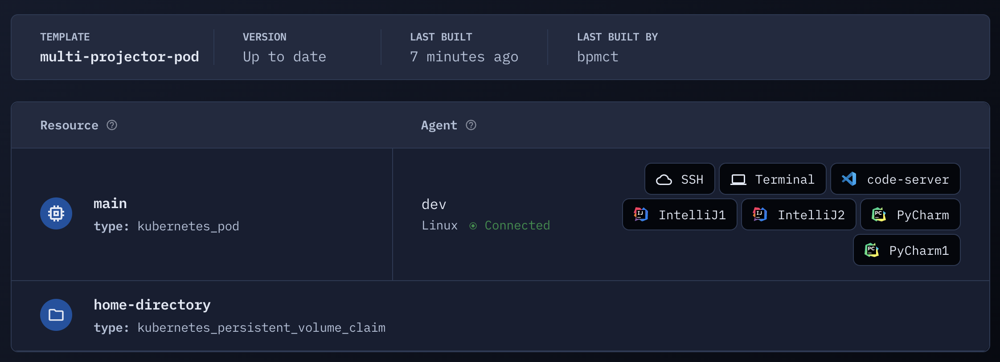

## projector-pod

This is a Kubernetes pod with multiple instances of JetBrains projector: 2 IntelliJ, 2 PyCharm



## How it works

- IDEs are installed in the image ([see Dockerfile](https://github.com/bpmct/coder-templates/blob/2dd8628e23a6597f68c45f904d08e60895ddc063/multi-projector-pod/Dockerfile#L63-L71)).
- Once the workspace starts, `projector` configures and runs different instances of each IDE for users to connect via web browser ([see startup_script](https://github.com/bpmct/coder-templates/blob/2dd8628e23a6597f68c45f904d08e60895ddc063/multi-projector-pod/main.tf#L57-L75))
- `coder_app` allows a user to access running services from the Coder dashboard ([see apps](https://github.com/bpmct/coder-templates/blob/2dd8628e23a6597f68c45f904d08e60895ddc063/multi-projector-pod/main.tf#L81-L115))

## Important notes

- This template uses my sample Dockerfile. You can build your own from [my example](https://github.com/bpmct/coder-templates/blob/2dd8628e23a6597f68c45f904d08e60895ddc063/multi-projector-pod/Dockerfile#L63-L71) and change it [in the template](https://github.com/bpmct/coder-templates/blob/2dd8628e23a6597f68c45f904d08e60895ddc063/multi-projector-pod/main.tf#L147)

- You cannot install IDEs in the image into `/home/coder`, as that is overridden by the volume. That is why different projector configurations are done at runtime with the startup script

- Add all IDEs must be in the image, with the `coder` user. I used [chown to do this](https://github.com/bpmct/coder-templates/blob/main/multi-projector-pod/Dockerfile#L71).

  - To add a new IDE, e.g. Goland, reference [enterprise-images](https://github.com/coder/enterprise-images/blob/91bf78a9dc6bb18a205f475a141987de4f1eae9e/images/goland/Dockerfile.ubuntu#L15-L17) and add to the Dockerfile

  - Build and push the image

  - Add a new projector config to the startup_script in the template:

    ```sh
    /home/coder/.local/bin/projector config add goland /opt/goland --force --use-separate-config --port 9005 --hostname localhost
    /home/coder/.local/bin/projector run goland &
    ```

  - Add a new coder_app to access the resource

    ```hcl
    resource "coder_app" "goland" {
      agent_id = coder_agent.dev.id
      name     = "goland"
      icon     = "/icon/goland.svg"
      url      = "http://localhost:9005"
    }
    ```

- Also see Coder's [templates documentation](https://coder.com/docs/coder-oss/latest/templates) for more details editing templates.
